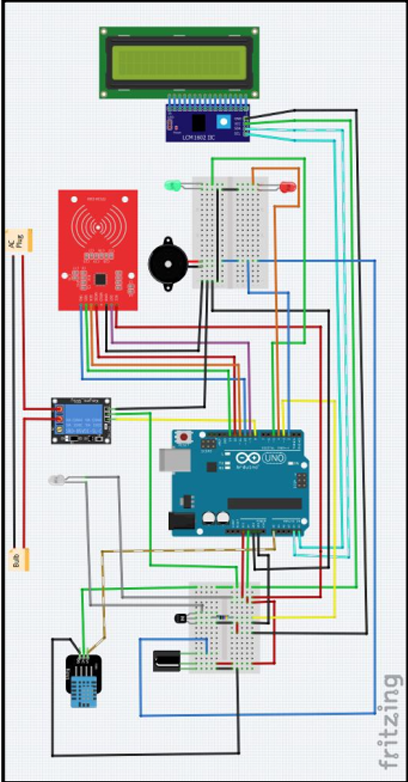

# 🎓 RFID Based Smart Classroom Monitoring System

A smart and automated classroom management system leveraging **RFID technology**, **Arduino**, and various sensors to automate attendance, control lighting, and monitor temperature — creating an efficient, secure, and intelligent learning environment.

---

## 🧠 Project Overview

In today’s digital age, most classroom activities such as attendance tracking and environment control are still done manually.  
This project introduces an **RFID-based Smart Classroom Monitoring System** that automates:

- Attendance recording  
- Classroom lighting and temperature control  
- Faculty identification and course display  
- Access security and classroom monitoring  

By integrating **RFID cards** with student and faculty IDs, the system enables automatic attendance and real-time classroom management, reducing manual work and improving operational efficiency.

---

## ⚙️ Key Features

✅ **Automatic Attendance Tracking** – Uses RFID cards to identify students and mark attendance.  
✅ **Faculty Identification** – Displays the faculty name, course code, and class duration.  
✅ **Smart Lighting System** – Automatically turns lights/fans on when the class starts.  
✅ **Temperature Control** – Uses the DHT11 sensor and IR module to control air conditioning based on room temperature.  
✅ **Security & Monitoring** – Ensures only authorized personnel can access the classroom.  
✅ **Centralized Data Storage** – Maintains attendance and class data in structured files.  

---

## 🧩 Components Used

| Component | Description |
|------------|-------------|
| **Arduino UNO** | The microcontroller board used to control all operations |
| **RFID Sensor** | Reads student/faculty RFID cards |
| **LCD Display (20x4)** | Displays class and faculty information |
| **I2C LCD Adapter** | Reduces wiring complexity using I2C communication |
| **Relay (Single Channel)** | Controls high-voltage devices like lights and fans |
| **DHT11 Sensor** | Measures temperature and humidity |
| **IR LED & Receiver** | Enables IR communication for AC control |
| **2N2222 Transistor** | Used for switching and signal amplification |
| **Buzzer & LEDs (G/R)** | Provide audio and visual feedback |
| **Breadboard, Jumper Wires, Holder, Bulb** | For circuit connections and testing |

---

## ⚙️ System Architecture

Below is a simplified circuit representation:

---

## 🧰 Implementation

The system operates in four main modules:

### 1. RFID Connection Module
- Scans RFID cards to identify users.
- Controls classroom lights, AC, and attendance recording.
- Green LED indicates success, red LED indicates error.

### 2. Temperature Module
- Uses DHT11 to monitor temperature.
- Automatically sends IR signals to control AC when temperature exceeds a set range.

### 3. Light Control Module
- Relay-based system for switching lights and fans automatically during class sessions.

### 4. Display Module
- LCD shows faculty name, course code, total students, and class duration in real time.

---

## 💡 Future Improvements

🔹 **Automatic Door Control** – Door opens automatically for authorized users.  
🔹 **Enhanced User Recognition** – Integration with facial recognition systems.  
🔹 **Database Integration** – Move from file storage to MySQL for scalable reporting.  
🔹 **IoT Dashboard** – Cloud-based monitoring and analytics for attendance and energy usage.

---

## 💻 Project Code Structure

/arduino/
└── main.ino
/c_source/
├── smart_classroom.c
├── Student.txt
├── Facultycode.txt
└── Attendance.txt
/images/
├── circuit-diagram.png
└── prototype.jpg

## 📚 References

1. Gupta, H., Singh, A., & Gupta, S. (2018). *RFID-Based Attendance System Using Arduino*. IJIRCCE, 6(3).  
2. Jain, S., Sharma, A., & Aggarwal, R. (2018). *Smart Classroom Monitoring and Controlling System Using IoT*. IJCA, 182(16).  
3. Mohan, R., & Chandrasekhar, K. (2018). *RFID Based Smart Attendance System with Face Recognition Using Raspberry Pi*. IJSRCS, 3(4).  

---

## 👨‍💻 Team Members

| Name | ID | Role |
|------|----|------|
| Nayem Sarkar | 011203032 | Circuit Design & Hardware |
| Neamul Islam Fahim | 011202216 | Arduino Programming |
| Tairin Islam | 011203012 | Data Handling & Debugging |
| Shah Merajur Rahman | 011201356 | Documentation & Testing |
| **Rabbi Islam Yeasin** | 011201067 | System Integration & Presentation |

---

## 🧩 How to Run

### 🔌 Hardware Setup
1. Connect all components as per the circuit diagram.
2. Upload the `main.ino` file to Arduino UNO using Arduino IDE.

### 🖥️ Software Setup
1. Compile and run `smart_classroom.c` for data handling.
2. Ensure `Student.txt` and `Facultycode.txt` are in the same directory.
3. View `Attendance.txt` for recorded attendance data.

---

## 🛠️ Built With

---

## 📜 License

This project is open-source and available under the **MIT License**.  
Feel free to use, modify, and distribute with proper attribution.

---

> 📘 **Author:** Rabbi Islam Yeasin  
> 🏫 United International University, Dhaka, Bangladesh  
> ✉️ [Connect on LinkedIn](https://www.linkedin.com/in/rabbiyeasin/)